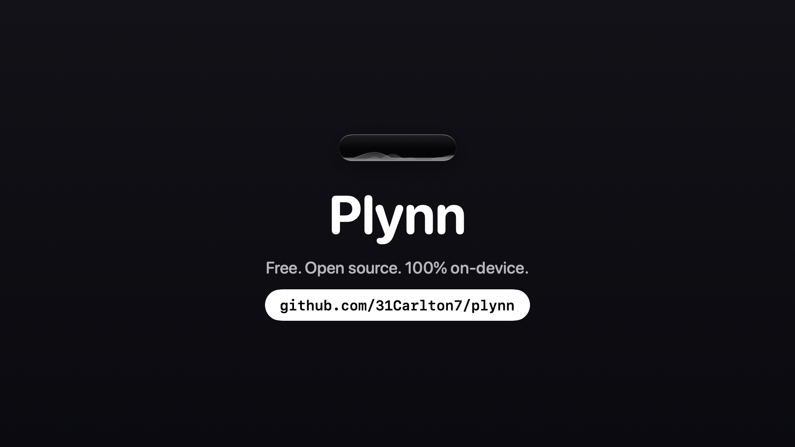

# Plynn



Dictation for your Mac that never touches the internet. Hold the fn key, talk, release, and clean text appears wherever your cursor is. Every part of it (speech recognition, AI cleanup, your dictionary, your history) runs on your Mac's own silicon.

I built this because I loved what Wispr Flow could do but didn't love sending my voice to a server to do it. Turns out Apple Silicon is fast enough that you don't have to.

## What it does

- **Hold fn and talk.** Live transcript streams into a floating glass pill while you speak. Release and it pastes. On an M-series Mac the paste lands in well under a second for typical dictations.
- **AI polish, on-device.** Fillers removed, self-corrections applied ("ship friday actually monday" becomes "ship on Monday"), spoken lists formatted, tone matched to the app you're in. Casual in Messages, proper in Mail. Runs on Apple Intelligence, with a local Qwen fallback.
- **Command mode.** Select any text, hold fn, and say what to do with it: "make this shorter", "fix the grammar". The selection gets replaced in place.
- **It learns your words.** Add names and jargon to your dictionary (or import a CSV), and when you fix a word right after a paste, Plynn notices and learns the correction on its own.
- **Snippets.** Say "my email" and your actual email comes out.
- **History and stats**, stored in a local SQLite file you can open yourself.
- Spoken punctuation, "new line", "press enter" to auto-send, secure-field detection so it never types into password boxes.

## Install

Grab it at [plynn.vercel.app](https://plynn.vercel.app), or grab `Plynn.dmg` from [Releases](../../releases), drag Plynn to Applications, and launch. The app is notarized, so there's nothing to bypass. Onboarding asks for microphone and accessibility permissions, and the speech models (about 1 GB) download in the background while Apple's built-in engine covers your first dictations.

**This tree is a Sequoia 15 / Intel compatibility port.** Upstream Plynn requires macOS 26 (Tahoe) on Apple Silicon. Here the hold-to-talk loop, paste, dictionary, snippets, and rules polish run on macOS 15.7 Intel using Apple's on-device Speech recognizer. Parakeet, Apple Intelligence, and the Qwen MLX polish model are not available on this hardware.

## Build from source

```bash
cd plynn
./scripts/make-app.sh
open build/Plynn.app
```

Needs the macOS Command Line Tools (Swift 6.1+) or Xcode 16. No Xcode 26 / Metal toolchain. After the first launch, grant Microphone, Speech Recognition, and Accessibility, then relaunch.

## How it's put together

On this Sequoia Intel port, speech recognition is Apple's on-device Speech framework. A deterministic rules pass still handles spoken punctuation, snippets, and your dictionary. The Neural Engine Parakeet stack and the MLX polish model are Apple Silicon / macOS 26 only.

Your dictionary, snippets, and history live in one SQLite file at `~/Library/Application Support/Plynn/`. Nothing is sent anywhere, ever. There's no account, no telemetry, and no server to go down.

See [ROADMAP.md](docs/ROADMAP.md) for what's next, including swappable polish models.

## License

MIT. See [LICENSE](LICENSE).
